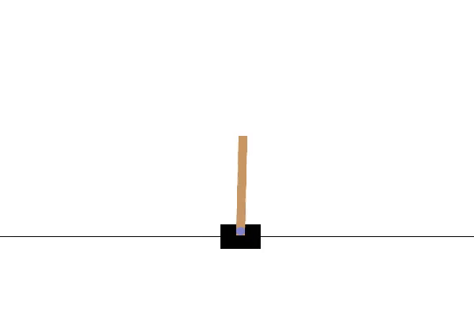
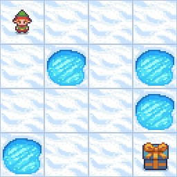
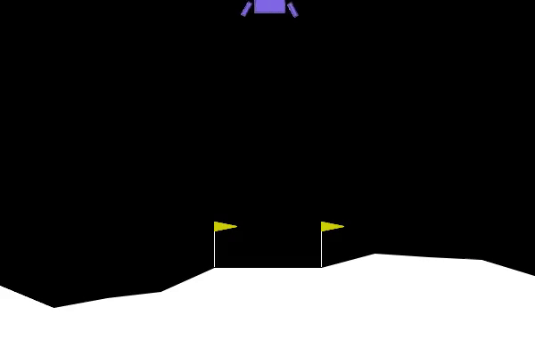

# Reinforcement Learning for Classic Control Environments

This project implements reinforcement learning agents to solve OpenAI Gym classic control environments: CartPole, FrozenLake, and LunarLander. Multiple training algorithms are supported including policy gradient methods (A2C, PPO) and Deep Q-Networks (DQN).

See the full project report: [project PDF](Primjena-podrzanog-ucenje-za-trening-agenta-u-jednostavnim-racunalnim-igrama.pdf)

---

## Project Structure

- `train/` - Training scripts for each environment using policy gradients and DQN  
- `test/` - Evaluation scripts for trained DQN agents  
- `play/` - Scripts to run trained agents visually (with video recording option)  
- `models/` - Saved model checkpoints (`.pth` files)  
- `logs/` - Training logs and learning curve images  
- `videos/` - Recorded gameplay videos  
- `.gitignore` - Git ignore configuration (ignores `__pycache__` folders)  
- `main.py` - Main entry point script providing menu to train, test, and play agents  

---

## Installation

1. Clone the repository  
2. Create and activate a Python virtual environment (recommended)  
3. Install required libraries:

pip install -r requirements.txt

---

## Usage

Run the main menu script:

python main.py

Follow the interactive menu to select:

- Environment (CartPole, FrozenLake, LunarLander)  
- Mode: Train (policy gradient / DQN), Test (DQN evaluation), or Play (visual run with rendering)  

### Separate scripts

You can also run scripts individually, e.g.:

- Train CartPole with policy gradients:  
  `python train/train_cartpole.py`  
- Train CartPole with DQN:  
  `python train/dqn_train_cartpole.py`  
- Test DQN agent on FrozenLake:  
  `python test/dqn_test_frozenlake.py`  
- Play LunarLander agent visually:  
  `python play/play_lunarlander.py`  

---

## File Naming Conventions

- Scripts related to training start with `train_` or `dqn_train_` for DQN  
- Testing/evaluation scripts start with `dqn_test_`  
- Playing/visualizing scripts start with `play_` or `dqn_play_`  
- Model checkpoint files are stored in `models/` folder as `.pth` files  
- Logs and learning curves are stored in `logs/`  
- Videos recorded during play are stored in `videos/`  

---

## Acknowledgements

- OpenAI Gym / Gymnasium for environment  
- Stable Baselines3 for RL algorithms  
- PyTorch for Deep Q-Network implementation  

---

## Sample RL Agent Performance

The following GIFs show the performance of trained agents:

### CartPole (A2C)

### FrozenLake (A2C)

### LunarLander (A2C)

